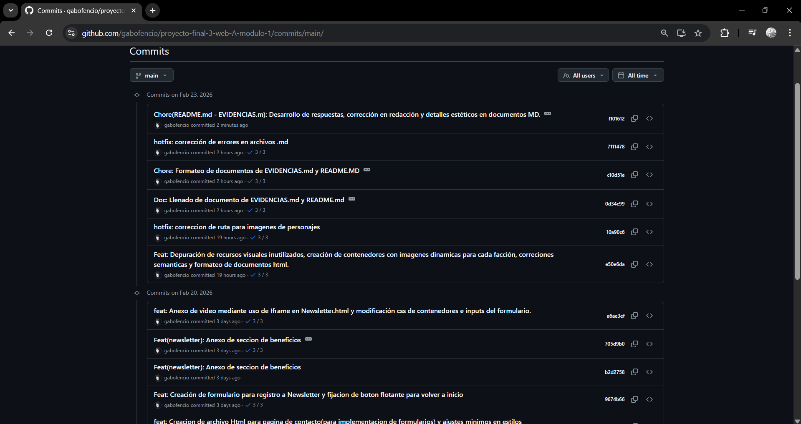
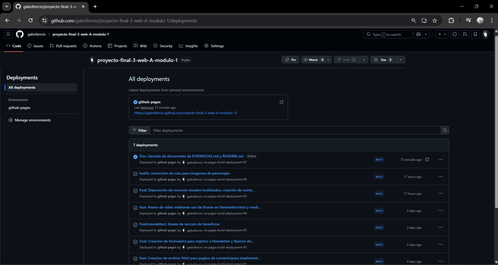
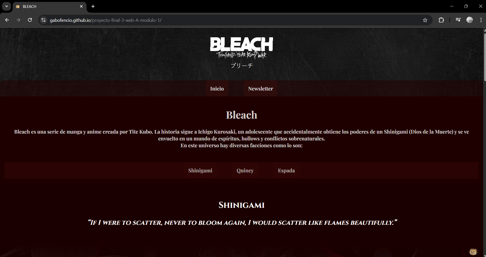
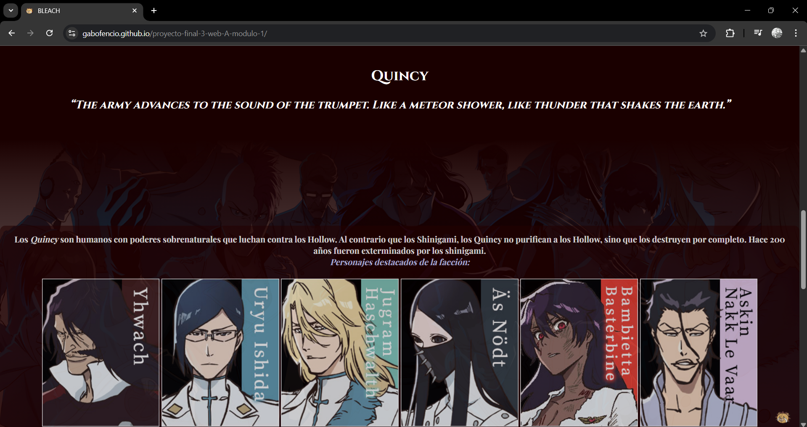
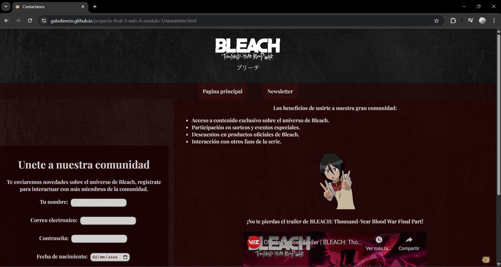
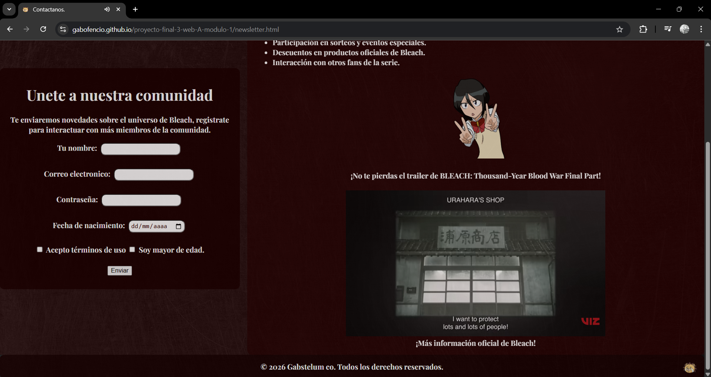

## 😼 😸 Evidencias del Proyecto final para el modulo 1 😸 😼

En este documento se anexan las diversas evidencias del proyecto desarrollado en el modulo 1, esto incluye:

- *Capturas de pantalla de github pages, historial de commits y el sitio desplegado.*

- *Enlace a la pagina desplegada.*

- *Sección de aprendizajes.* 

------------------------------------------------------------------------

## 😼 📂 Ubicación de las evidencias 📂 😼
Todas las evidencias se encuentran dentro de la carpeta 
    /EVIDENCIAS
------------------------------------------------------------------------

## 😼 💾 Vista de historial de commits 💾 😼

## 😼 🌐 Vista de Github Pages 🌐 😼

## 😼 📃 Vista de pagina desplegada 📃 😼

------------------------------------------------------------------------

## 😼 🔗 Enlace a la pagina desplegada 🔗 😼

Github Pages:
`https://gabofencio.github.io/proyecto-final-3-web-A-modulo-1/`

------------------------------------------------------------------------

## 😼 🧠 Aprendizajes 🧠 😼

## 😼 🔥 1. ¿Qué fue lo más fácil y lo más retador? 🔥 😼

**Respuesta:**

- *Lo más fácil fue llevar a cabo la estructura de HTML de las páginas así como establecer la estética de las mismas.*

- *Lo más retador que se presentó para mí fue llevar a cabo un diseño consistente a lo largo de la página, encontrar recursos audiovisuales adecuados y depurar los errores semánticos que se me presentaron durante el desarrollo del proyecto.*

------------------------------------------------------------------------

## 😼 🔥 2. ¿Qué etiquetas semánticas usaste y por qué? 🔥 😼

**Respuesta:**

- `<doctype html>:` *Para definir que el documento es un HTML y que los navegadores lo puedan leer.*

- `<html>:` *Para establecer los limites de lo que el navegador va a leer y establecer el idioma de la pagina con `lang`*

- `<head>:` *Lo utilicé para enlazar las hoja de estilos a las paginas y para los metadatos (configuración general de la página).*

- `<title>:` *La utilice para poner el titulo que aparece en las pestañas del navegador.*

- `<meta>:` *para configurar los modos de visualización con `viewport` y para los caracteres mediante el `charset`*

- `<body>:` *Para contener todo el contenido visible del cuerpo de las páginas.*

- `<header>:` *Implemente esta etiqueta para establecer la cabecera de la página sirviendo como encabezado en el que implemente el logotipo y el nombre de la serie en japonés.*

- `<h1>:` *Lo usé para los titulos principales de las páginas.*

- `<h2>:` *Para los encabezados de cada sección en el index (Shinigami, Quincy, Espada).*

- `<h3>:` *Para los poemas que continúan en jerarquía a los encabezados.*

- `
:` *Para parrafos de texto cortos independientes dentro de las páginas.*

- `<ul> y <li>:` *Para crear el listado de beneficios en el newsletter.*

- `<strong> y <i>:` *Para hacer énfasis de palabras especificas inline.*

- `<a>:` *Para la creación de enlaces en las barras de navegación, botones de volver al inicio, y páginas externas de más información. (La imagen de kon flotante es un a href con una imagen insertada).*

- `<iframe>:` *Para insertar un video de youtube dentro de la página de newsletter.*

- `:` *Lo usé en varias instancias en las que requerí insertar imágenes con texto alternativo, por ejemplo: El encabezado de la página con el logotipo de la serie, los personajes destacados de cada facción, el botón de kon para volver al inicio, la imagen de rukia saludando en el newsletter.*

- `<nav>:` *Hice uso de esta etiqueta en dos instancias dentro de la página, una de navegación general dentro de los archivos del proyecto (inicio/newsletter). Y una segunda instancia para navegación interna dentro del index entre las diversas secciones (Shinigami, Quincy, Espada).*

- `<section>:` *La usé para dividir el contenido de mi página en secciones temáticas de la página como son: introducción, Shinigami, Quincy, Espada.*

- `<article>:` *La usé para texto que se puede leer en grandes cantidades como lo son las descripciones de las facciones.*

- `<footer>:` *La utilicé para implementar un pie de página donde añadí elementos como el botón flotante de kon, el botón para volver al inicio de la página y los derechos de autor.*

- `<form>:` *Utilice la etiqueta en la página de newsletter para crear un registro como usuario al newsletter y a la comunidad.*

- `<label>:` *Lo utilicé para ponerle etiquetado visual a cada elemento del formulario de registro y que el usuario sepa que dato introducir al formulario.*

- `<input>:` *utilizado para la entrada de datos al formulario en diversos tipos (text, email, password, date y checkbox).*

- `<button>:` *para la creación del botón de enviado en el formulario.*

------------------------------------------------------------------------

## 😼 🔥 3. ¿Cómo organizaste tus commits? 🔥 😼

**Respuesta:**

*Organicé mis commits de forma gradual conforme al desarrollo del proyecto, los factores principales que tome en cuenta para llevar a cabo mis commits fueron los siguientes:.*

- *Estructurado de archivos en el proyecto*

- *Modificaciones de arquitectura dentro de los archivos Html*

- *Incorporación de recursos de texto y audiovisuales en los archivos*

- *formateo y estilización mediante css*

- *Modificaciones y Hotfixes en diseño, redaccion o semantica.*

- *Depuración de errores y recursos innutilizados*

- *Documentación del proyecto*

------------------------------------------------------------------------

## 😼 🔥 4. ¿Qué mejorarías en la siguiente iteración? 🔥 😼

**Respuesta:**

- *Optimizaría mi manejo de clases de CSS.* 

- *Mejorar en uso de etiquetas semanticas.* 

- *Implementación de tarjetas de presentación y prototipos de foro para la comunidad.*